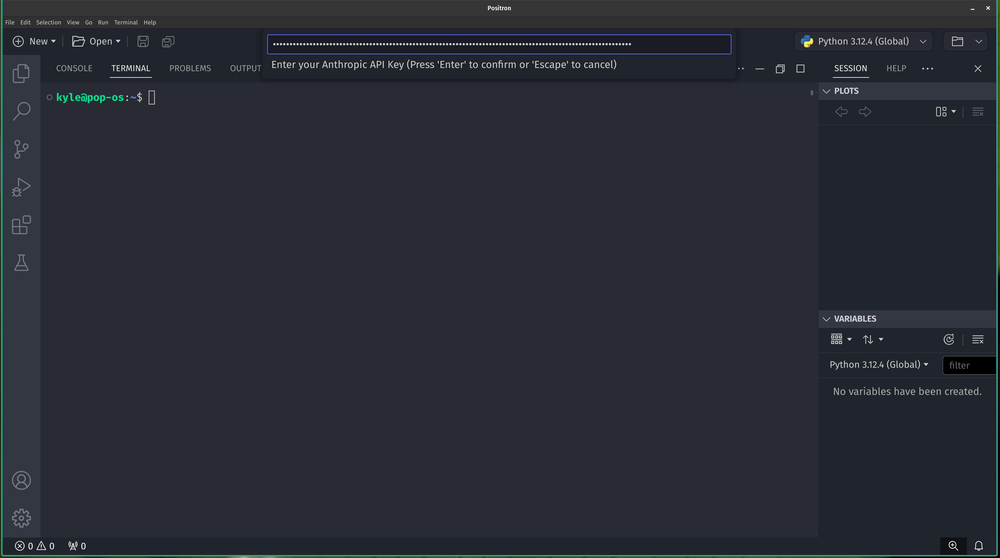

# Claude Chat for VSCode and Positron

This extension integrates Anthropic's Claude 3.5 model into VSCode and Positron, enabling intelligent chat-based code assistance with session memory.

## Features

- Direct integration with Anthropic's Claude 3.5 model
- Chat-based code assistance with session memory
- Friendly and helpful AI responses
- More accurate and context-aware than alternatives like Copilot or ChatGPT

## Requirements

- An Anthropic API key (register at https://www.anthropic.com)
- Purchased tokens for API usage

## Installation

1. Download the VSIX file from this repository.
2. Open VSCode or Positron.
3. Press `Ctrl+Shift+P` (or `Cmd+Shift+P` on macOS) to open the command palette.
4. Type "Install from VSIX" and select the option.
5. Choose the downloaded VSIX file to install the extension.

For more detailed instructions on installing external extensions, see [Installing Extensions in VS Code](https://code.visualstudio.com/docs/editor/extension-marketplace#_install-from-a-vsix).

## Setup

1. After installation, use `Ctrl+Shift+P` (or `Cmd+Shift+P` on macOS) to open the command palette.
2. Search for "Set Anthropic API Key" and enter your Anthropic API key.

## Usage

1. Use `Ctrl+Shift+P` (or `Cmd+Shift+P` on macOS) to open the command palette.
2. Search for "Start Claude AI Chat" to see available commands.
3. Start chatting with Claude for code assistance and more!

## Screenshots

*Image description: The VSCode command palette showing two options for the extension: "Start Chat Session" and "Store OpenAI API Key".*

*Image description: A dialog box prompting the user to enter their OpenAI API key. The entered key is hidden and displayed as asterisks (********) for security.*

*Image description: An example chat session within VSCode. The user says "Hi" and asks for a simple Python script, with the AI assistant's response shown below.*

## Known Issues

Further testing is still in progress. Please report any issues you encounter.

## Release Notes

### 0.1.0

Initial developmental release of Claude Chat for VSCode and Positron.

---

## Future Improvements and Feedback

### Planned Enhancements

We are committed to improving this extension and have several enhancements planned for future releases:

1. **Improved Code Output Rendering**: We aim to enhance the way code outputs are displayed, making them more readable and user-friendly.

2. **UI Improvements**: Various user interface changes are in the pipeline to create a more intuitive and efficient user experience.

### Current Status and Call for Feedback

This initial version of the extension is functional and ready for use. However, to reach its full potential, we need input from experienced developers and users.

#### How You Can Help

1. **Try the Extension**: Use the extension in your daily workflow and note any issues or areas for improvement.

2. **Provide Feedback**: Share your thoughts, suggestions, and any bugs you encounter. Your real-world usage insights are invaluable.

3. **Contribute**: If you're an experienced developer, consider contributing to the project. Your expertise can help shape the future of this extension.

#### How to Submit Feedback

- Open an issue on our GitHub repository
- Send an email to [kylegrealis@icloud.com]

Your input is crucial in making this extension more robust and user-friendly. We appreciate your support in this early stage and look forward to growing and improving with your help.

## License

This extension is licensed under the [MIT License](LICENSE).

**Enjoy coding with Claude!**